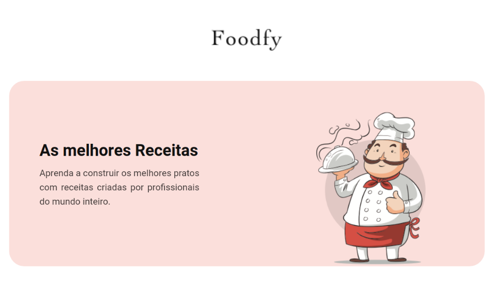
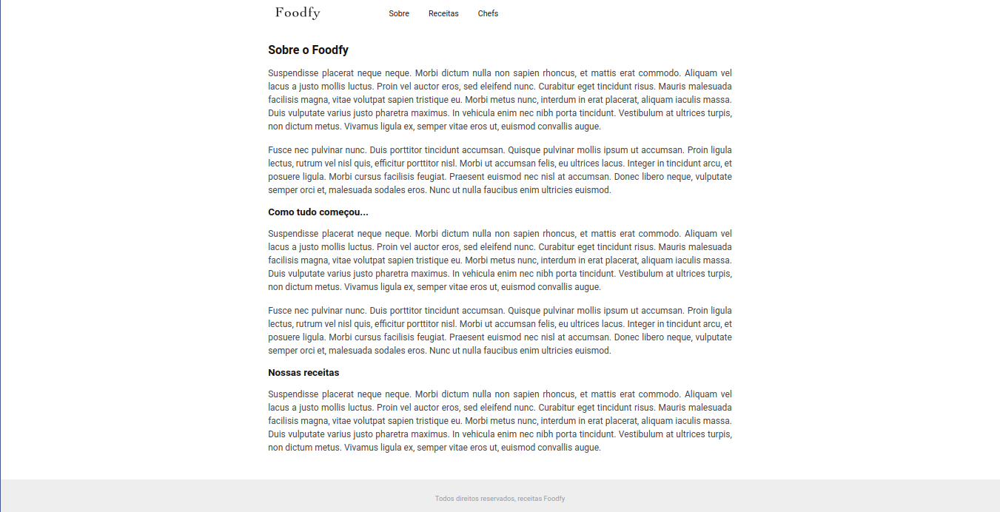
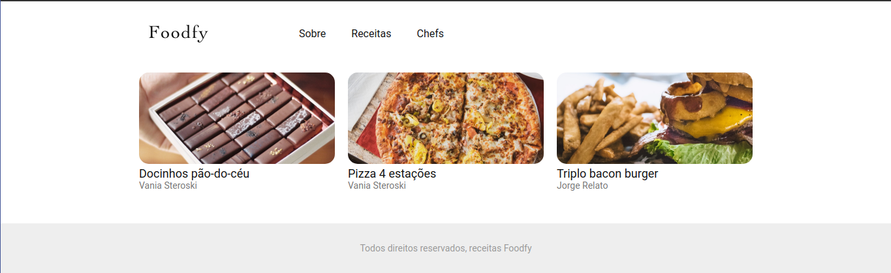
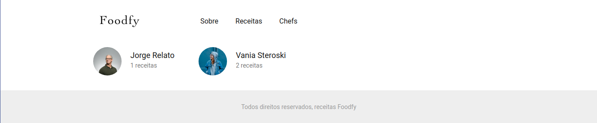
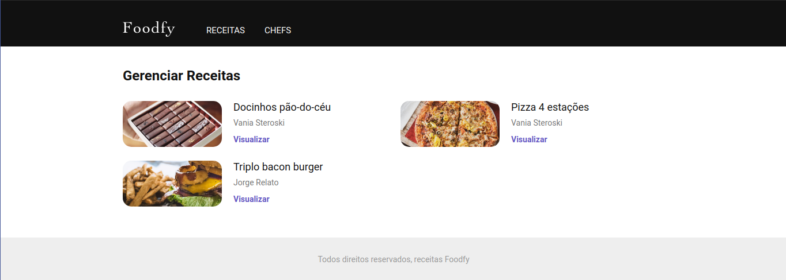
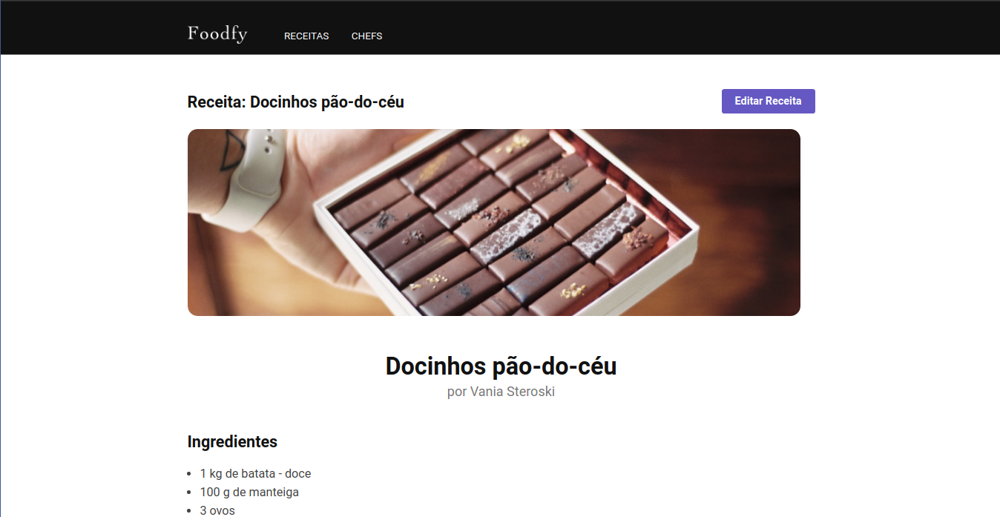
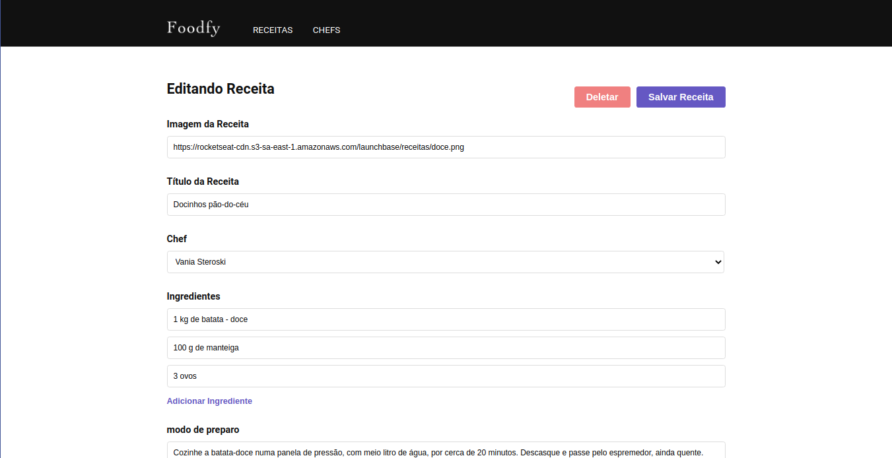
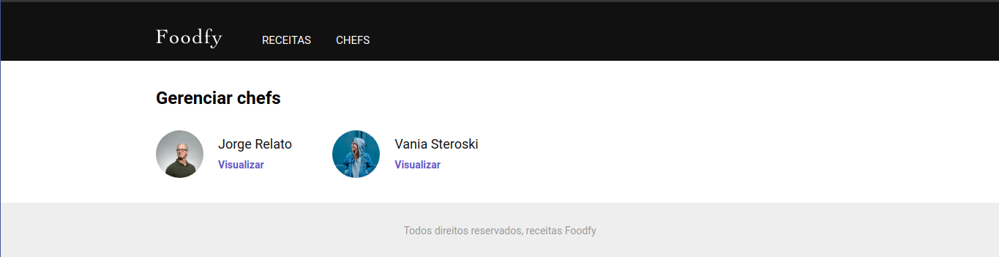
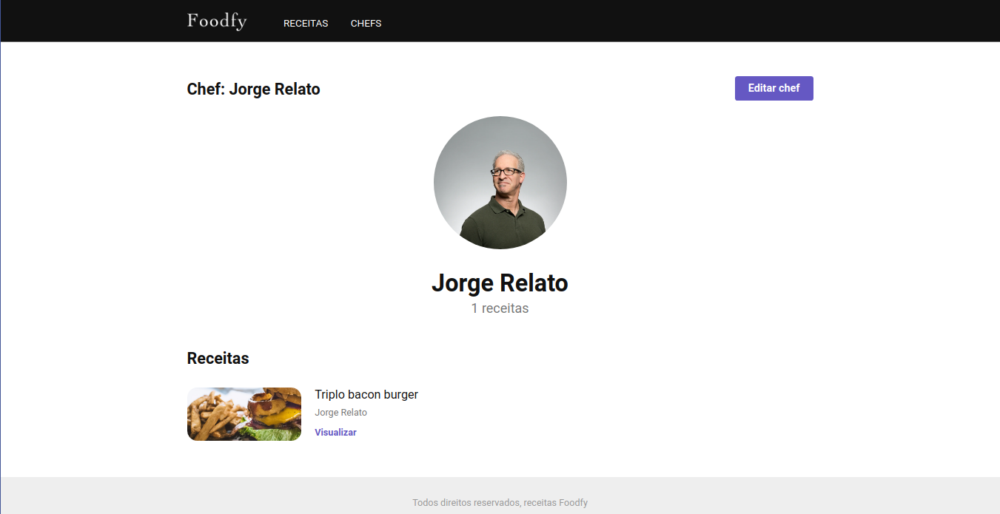
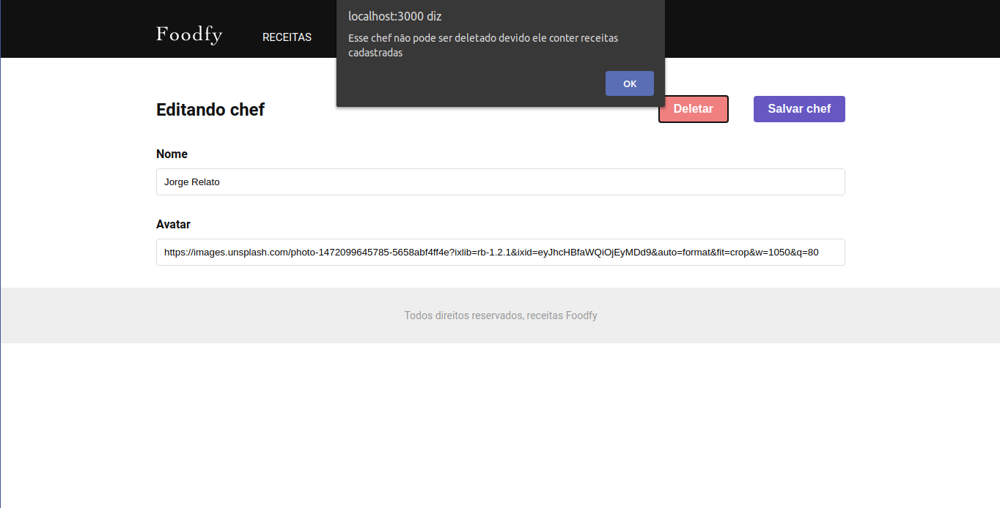

<h1 align="center">
     
</h1>
 
<h4 align="center"> 
	🚀 Desafio Principal - Foodfy version 4 🚀
</h4>

<p align="center">
  

  

  	
  <a href="https://www.linkedin.com/in/paulobeckman/">
    
  </a>
	
  
  <a href="https://github.com/paulobeckman/Foodfy/commits/master">
    
  </a>

  
   <a href="https://github.com/paulobeckman/Foodfy/stargazers">
    
  </a>
</p>


## 💻 Sobre o projeto

🍛 Foodfy é um site que nesse projeto está na versão 4. Nesse site o chef pode cadastrar, visualizar, editar e deletar seu perfil pela pagina admin. Além disso, o chefe pode cadastrar, editar, visualizar e deletar a sua receita, também pela pagina admin. Com isso, seja o chef, seja a receia, uma vez cadastrados podem ser visualizados na página de receitas onde todos todos podem somente visualizar.
Ao deletar o chef, se o mesmo possuir pelo menos uma receita, é retornado uma mensagem de erro informando que o chef possui receitas e por isso não pode ser deletado. 

- Para criar um chef é necessário cadastrar os seguintes items:
  - nome do chef
  - url de imagem do chef
  
- Para criar uma receita é necessário cadastrar os seguintes items: 
  - uma url da imagem da receita;
  - o título da receita;
  - selecionar o nome do chef
  - ingredientes;
  - modo de preparo;
  - mais informações.

Na aba receitas, na rota de visualizações, apresenta vários cards de receitas que ao serem clicados, o usuário irá ser direcionado para uma página onde encontrado mais detalhes daquela receita como o Ingredientes, Modo de preparo e Informações adicionais, cada tópico desse, conta com um botão que permite o usuário esconter ou mostrar o conteúdo do tópico.

Na aba chefs, na rota de visualizações, apresenta vários cards de chefs cadastrados e a quantidade de recitas que ele possui.


Projeto desenvolvido como desafio no curso **LaunchBase** oferecida pela [Rocketseat][rs].

"O [LaunchBase](lb) é um treinamento no formato de bootcamp online que tem duração de 8 semanas. A cada semana os conteúdos são liberados de acordo com um cronograma, guiando o aluno pelas ferramentas e conceitos mais modernos de desenvolvimento que permitirão construir as melhores aplicações e ter acesso às melhores oportunidades como programador." - Rocketseat


### Web

<p align="center" style="display: flex; align-items: flex-start; justify-content: center;">
	
  

  

  
  
  
  
  

  

  
  
  

  

  

  

  


</p>

## 🛠 Tecnologias

As seguintes ferramentas foram usadas na construção do projeto:

- [Node.js][nodejs]
- [JavaScript][js]
- [CSS][CSS]
- [HTML][HTML]
- [Nunjucks][Nunjucks]
- [PostgreSQL][PSQL]


## 🚀 Como rodar este projeto

Podemos considerar este projeto como sendo divido em duas partes:
1. Back End (arquivos server.js, data.json, routes.js e pasta public o arquivo script.js) 
2. Front End (pasta views, pasta public o arquivo styles.css)

💡Ao iniciar tanto o front end quanto o back end iniciarão automaticamente. 

### Pré-requisitos

Antes de começar, você vai precisar ter instalado em sua máquina as seguintes ferramentas:
[Git](https://git-scm.com), [Node.js][nodejs]. 
Além disto é bom ter um editor para trabalhar com o código como [VSCode][vscode]

### 🧭 Rodando a aplicação web (Front End e Back End)

```bash
# Clone este repositório
$ git clone https://github.com/paulobeckman/Foodfy.git

# Acesse a pasta do projeto no terminal/cmd
$ cd Foodfy

# Instale as dependências
$ npm install

# Execute a aplicação em modo de desenvolvimento
$ npm start

# O servidor inciará na porta:5000 - acesse http://localhost:5000
```


## 📝 Licença

Este projeto esta sobe a licença MIT. Veja a [LICENÇA](license) para saber mais.

Feito por Paulo Beckman 👋🏽 [Entre em contato!](https://www.linkedin.com/in/paulobeckman/)

[nodejs]: https://nodejs.org/
[vscode]: https://code.visualstudio.com/
[license]: https://opensource.org/licenses/MIT
[rs]: https://rocketseat.com.br
[lb]: https://pages.rocketseat.com.br/launchbase/inscricao/5
[js]: https://developer.mozilla.org/pt-BR/docs/Aprender/JavaScript
[CSS]: https://developer.mozilla.org/pt-BR/docs/Web/CSS
[HTML]: https://developer.mozilla.org/pt-BR/docs/Web/HTML
[Nunjucks]: https://www.npmjs.com/package/nunjucks
[PSQL]: https://www.postgresql.org/

